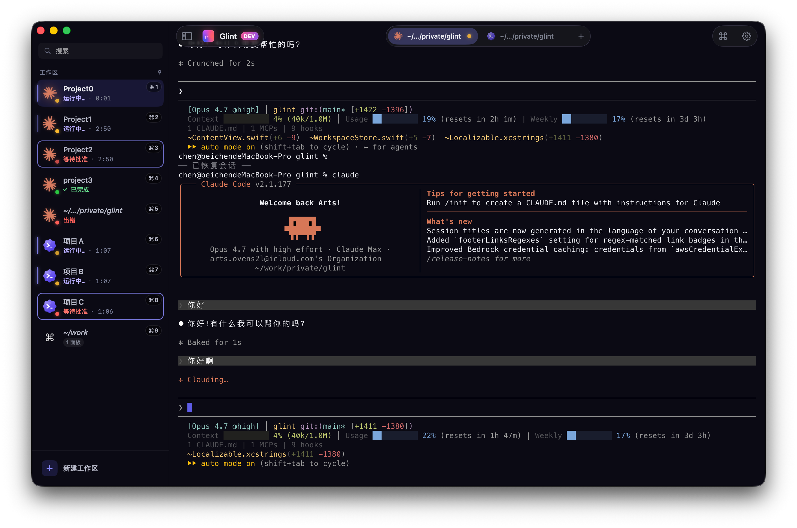
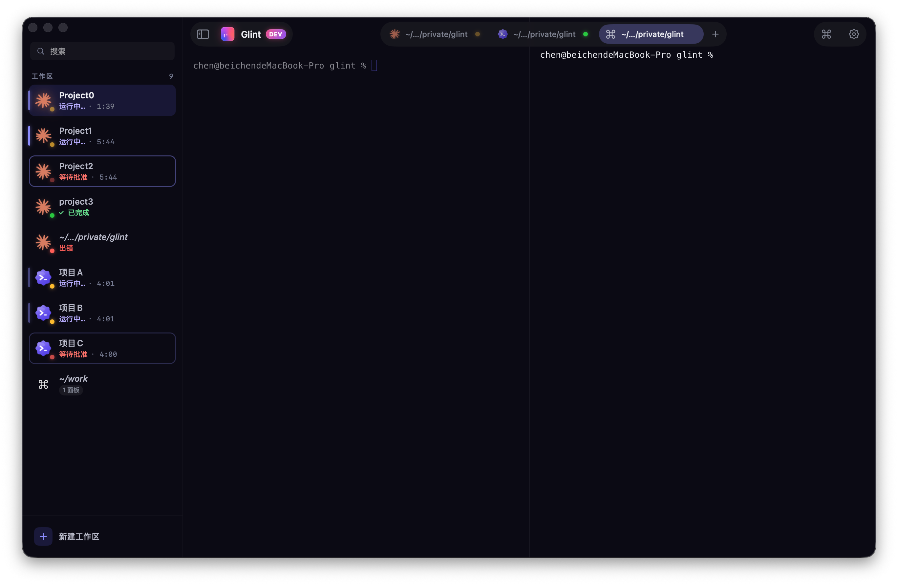

# Glint

English · [中文](README.md)

A polished macOS terminal made for AI agents. SwiftUI + AppKit, with [Ghostty](https://ghostty.org) under the hood.





## Install

### Homebrew (recommended)

```bash
brew tap chenbstack/glint
brew install --cask glint
```

### Manual download

Grab the latest `Glint-x.y.z.dmg` from the [Releases](https://github.com/chenbstack/glint/releases) page, mount it, and drag `Glint.app` into `/Applications`.

If macOS refuses to open it with "developer cannot be verified", run once:

```bash
xattr -dr com.apple.quarantine /Applications/Glint.app
```

The Homebrew Cask does this automatically.

## Upgrade & uninstall

```bash
brew upgrade --cask glint
brew uninstall --cask glint
```

## License

MIT — see [LICENSE](LICENSE).
